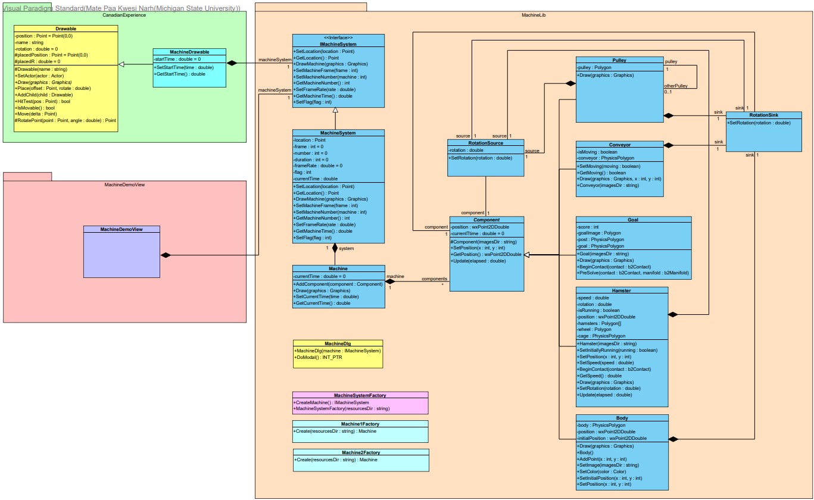

# MachineDemo
C++ Object Oriented Design Project

Machines #1 and #2 can be selected from the user interface.

## wxWidgets Dependency (version 3.2.4 used)
Download and extract wxWidgets binaries for Windows from https://www.wxwidgets.org/downloads/
(Don't forget the header package!)

If necessary, set the wxWidgets_ROOT_DIR environment to the folder containing the binary packages.

May need to add wxWidgets DLL folder to PATH environment.